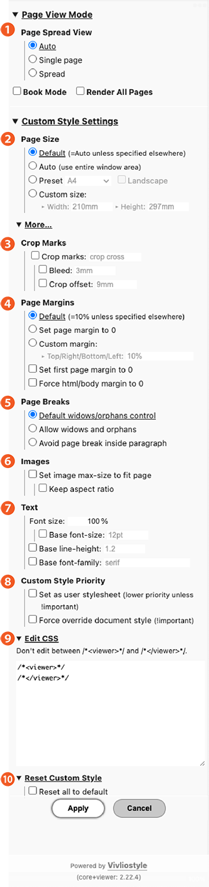

# Vivliostyle Viewer

Vivliostyle Viewer は、HTML+CSS文書を組版・表示するWebアプリケーションです。

## 使い方

### Vivliostyle Viewer をローカル環境で利用するには

Vivliostyle Viewer をローカル環境で利用するには、Vivliostyle CLI の preview コマンドを使うのが便利です。Vivliostyle CLI のインストール方法と使い方については、[Vivliostyle CLI ユーザーガイド](./vivliostyle-cli.md)、preview コマンドについては [組版結果のプレビュー](./vivliostyle-cli#組版結果のプレビュー) をご覧ください。

それ以外の方法で Vivliostyle Viewer をローカル環境で利用する場合は、配布パッケージに同梱の [README](https://github.com/vivliostyle/vivliostyle.js/blob/master/packages/viewer/README.ja.md) に記載の「使い方」の手順にしたがってWebサーバーを起動してください。

### オンライン公開 Vivliostyle Viewer

オンラインで公開されている [vivliostyle.org/viewer/](https://vivliostyle.org/viewer/) も利用でき、これは常に最新のリリース版に更新されています。いち早く最新のバージョンを試したい場合は、[vivliostyle.vercel.app](https://vivliostyle.vercel.app)を利用してください。

### Vivliostyle Viewer を自分のサイトに配置

Vivliostyle Viewer の配布パッケージ（https://vivliostyle.org/ja/download/ からダウンロード）を解凍したものを自分のサイトに配置すれば、自分のサイトで Vivliostyle Viewer で閲覧する出版物を公開することができます。

Node.js のアプリケーションで利用するには、npmパッケージ版の [@vivliostyle/viewer](https://www.npmjs.com/package/@vivliostyle/viewer) を使用してください。

### Vivliostyle Viewer のスタートページ

パラメータを指定しないで [Vivliostyle Viewer](https://vivliostyle.org/viewer/) を開くと、文書URLの入力欄 (“Input a document URL”)、 **Book Mode** と **Render All Pages** のチェックボックス、および使い方のヘルプが表示されます。

試してみる: <https://vivliostyle.org/viewer/>

## 設定パネル

Vivliostyle Viewer の画面右上の設定ボタン をクリック（またはキーボードのSを押下）すると、設定パネルが表示されます。

この設定パネルから各種パラメーターを設定し、“Apply” ボタンを押すことで、組版表示を変更することができます（通常は “Apply” の押下後パネルは閉じますが、設定ボタンを2度押しして開いた場合、押下後もパネルを開いたままにできます）。

設定パネルで設定した内容は、URLパラメータに反映されます。そうした設定付きURLを、ブックマークしたり公開することもできます。 例： [『Cascading Style Sheets Level 2 Revision 1 (CSS 2.1 Rec) Specification』](<https://vivliostyle.org/viewer/#src=https://www.w3.org/TR/2011/REC-CSS2-20110607&style=data:,/*%3Cviewer%3E*/%0A@page%20%7B%20size:%20a5;%20margin:%2010%25;%20marks:%20crop%20cross;%20bleed:%203mm;%20%7D%0A:root%20%7B%20line-height:%201.8;%20%7D%0A/*%3C/viewer%3E*/%0A@page%20:first%20%7B%0A%20%20@top-left%20%7B%0A%20%20%20%20content:%20none;%0A%20%20%7D%0A%20%20@top-right%20%7B%0A%20%20%20%20content:%20none;%0A%20%20%7D%0A%20%20@bottom-center%20%7B%0A%20%20%20%20content:%20none;%0A%20%20%7D%0A%7D%0A%0A@page%20:left%20%7B%0A%20%20font-size:%200.8rem;%0A%20%20@top-left%20%7B%0A%20%20%20%20content:%20env(pub-title);%0A%20%20%7D%0A%20%20@bottom-center%20%7B%0A%20%20%20%20content:%20counter(page);%0A%20%20%7D%0A%7D%0A%0A@page%20:right%20%7B%0A%20%20font-size:%200.8rem;%0A%20%20@top-right%20%7B%0A%20%20%20%20content:%20env(doc-title);%0A%20%20%7D%0A%20%20@bottom-center%20%7B%0A%20%20%20%20content:%20counter(page);%0A%20%20%7D%0A%7D&spread=true>)（設定パネルから “Crop marks” にチェックを入れるなどした例。“Edit CSS” をクリックすると、設定内容の詳細が確認できます）。

- 凡例：◉ラジオボタン、■チェックボックス、▶折りたたまれた設定項目



- **▶Page View Mode**
  - **❶Page Spread View**：ページ表示
    - ◉Auto：ウインドウが見開きで表示可能な縦横比であれば、自動的に見開きにします
    - ◉Single page：常に単一ページで表示します
    - ◉Spread：常に見開きページで表示します
  - ■Book Mode：チェックを入れると[ブックモード](#urlパラメータのオプション)になります
  - ■Render All Pages：チェックを入れると、常に全ページをレンダリングします。正確なページ番号が表示される反面、表示まで時間がかかります。詳細は[「全ページをレンダリング（Render All Pages）On/Off設定」](https://vivliostyle.github.io/vivliostyle_doc/ja/vivliostyle-user-group-vol1/shinyu/index.html#全ページをレンダリング（render-all-pages）onoff設定)を参照
- **▶Custom Style Settings**
  - **❷Page Size**（ページサイズ）
    - ◉Default：文書でページサイズ指定されていればそのサイズが、指定されていない場合はその時開かれているウィンドウのサイズが適用されます
    - ◉Auto：ページサイズ指定の有無にかかわらず、その時開かれているウィンドウのサイズが適用されます
    - ◉Preset：次の値の中から選択できます。letter、legal、Ledger、A10〜A0、B10 (ISO)〜B0 (ISO)、JIS-B10〜JIS-B0、C10〜C0（なお、日本で使われるB判は「JIS-B」であることにご注意ください）
      - ■Landscape：Presetで選択したサイズの横置きにします
    - ◉Custom size：任意の幅と高さを指定できます。単位は CSSの単位（mm, cm, in, pt, px など）が使えます
- **▶More...**
  - **❸■Crop Marks**：トンボを入れる場合はここにチェックを入れます。Bleedにも自動的にチェックが入ります。コーナートンボだけを入れたい場合は`crop`、センタートンボだけを入れたい場合は`cross`と記述します。デフォルトは`crop cross`、つまり両方入ります
    - ■Bleed:コーナートンボにおける裁ち切り線（外側の線）と仕上がり線（内側の線）の間隔を単位付きの数値で指定します（通常は`3mm`）
    - ■Crop offset:仕上がり線（内側の線）から用紙端までの余白サイズを指定したい場合は単位付きの数値で指定します。単位はCSSの単位（mm, cm, in, pt, px など）が使えます
  - **❹Page Margins**：ページ余白
    - ◉Default (=10% unless specified elsewhere)：文書でページ余白が指定されていればそれに従い、指定されていない場合は上下左右の余白をページサイズ（高さ／幅）の10%ずつにします
    - ◉Set page margin to 0：ページ余白を0にします。固定レイアウトのEPUBなど、画面いっぱいに表示するのに適したコンテンツを閲覧するのに向いています
    - ◉Custom margin：任意のページ余白を指定できます。上右左下の順でそれぞれを半角スペースで区切って記述します。また、`20mm 15mm 10mm`などと3つの値を記述すると、上の余白が`20mm`、右と左の余白が**ともに**`15mm`、下の余白が`10mm`になります。
    - ■Set first page margin to 0：最初のページ余白を0にします。最初のページがカバー画像で余白は不要の場合は、ここにチェックを入れます
    - ■Force html/body margin to 0：html/bodyマージンを0にします。もともとHTML文書で指定されているスタイルシートで`body`要素にマージンが設定されている場合、Vivliostyleで設定されたページ余白が加わると余白が異常に大きくなってしまいます。そのような場合ここにチェックを入れると回避できます
  - **❺Page Breaks**：改ページ
    - ◉Default widows/orphans control：デフォルトとして、段落を分割する際にページの先頭／末尾に2行以上が残るように制御します
    - ◉Allow widows and orphans：ページの先頭／末尾に1行だけ孤立する状態を許容します
    - ◉Avoid page break inside paragraph：段落の途中で改ページしてほしくない場合に指定します。例えば音声読み上げでテキストを読む場合に、段落の途中でページが変わるとそこで読み上げが中断してしまう問題を解決します
  - **❻Images**：画像
    - ■Set image max-size to fit page：画像の最大サイズをページに収まるよう調整します
    - ■Keep aspect ratio：画像サイズを変更する場合、画像の縦横比が変わらないよう調整して変更します
  - **❼Text**：テキスト
    - Font size：文字サイズをパーセント値で設定します。100%はブラウザのデフォルトと同様、16px=12ptです。この設定はツールバーにあるA- (Text: Smaller)、A+ (Text: Larger) ボタンで変更できる文字サイズと連動します 　
      - ■Base font-size：ルート要素での`font-size`プロパティの値を設定します。実際に表示される文字サイズは **Font size** のパーセント値と掛け合わされたものになりま
    - ■Base line-height：ルート要素での`line-height`プロパティの値を設定します。単位をつけない数値で文字サイズを基準にした行の高さを指定します。ここで指定しない場合、ブラウザと同じ`line-height: normal`が設定され、使われるフォントに依存します（おおむね1.2）
    - ■Base font-family：ルート要素における`font-family`プロパティの値を設定します
  - **❽Custom Style Priority**
    - ■Set as user stylesheet (lower priority unless !important)：設定パネルでの設定内容を、ユーザースタイルシートとして設定します。デフォルトは作成者スタイルシートです。これらの違いは[CSS カスケード入門](https://developer.mozilla.org/ja/docs/Web/CSS/Cascade#%E3%82%AA%E3%83%AA%E3%82%B8%E3%83%B3%E3%81%AE%E7%A8%AE%E9%A1%9E)をご参照ください
    - ■Force override document style (!important)：設定パネルでの設定内容により、スタイルシートを強制的に上書きします（スタイルシートに`!important`が付く）
- **❾▶Edit CSS**：クリックすると入力フィールドがあらわれ、それまでの設定した内容がCSSコードで確認できます。また、ここからユーザーがCSSコードを直接書くことができます。その場合、自動生成されたコメント`/*<viewer>*/`と`/*</viewer>*/`で囲まれた部分はそのままにして、その前か後にコードを追加するようにしてください
- **❿▶Reset Custom Style**
  - ■Reset all to default：それまでの設定内容を初期化し、デフォルトに戻します

## サポートされている文書の種類

- HTML文書＋ページメディア用のCSS
- 本のような出版物（目次付き） (**Book Mode**: オン)
  - Web出版物（複数のHTML文書からなるコレクション）: 最初のHTMLまたはマニフェストファイルのURLを指定します。
  - ZIP解凍済みのEPUB: OPFファイルのURLまたは解凍されたEPUBファイルのトップディレクトリを指定します。

### メモ

- GitHubとGistのURLを直接指定することができます。そのようなURLが指定された場合、Vivliostyle は github/gist の raw コンテンツをロードします。
- ⚠️Mixedコンテンツ（“http:” のURLが “https:” の Vivliostyle Viewer に指定された場合）は通常ブラウザによってブロックされます。
- ⚠️Cross-Origin（異なるドメインへのリクエスト）は、サーバーが Cross-Origin Resource Sharing (CORS) を許可するように設定されていない限り、通常はブラウザによってブロックされます。

## URLパラメータのオプション

- #**src**=&lt;document URL>
- &amp;**bookMode**=[**true** | **false**] (**Book Mode**)
  - **true** (デフォルト): 本のような出版物（目次付き）用
    - HTML文書のURLが指定された場合、その出版物マニフェストまたは目次（`<nav role="doc-toc">` などでマークアップ）からリンクされた一連のHTML文書が自動的に読み込まれます。
  - **false**: 単体のHTML文書用
- &amp;**renderAllPages**=[**true** | **false**] (**Render All Pages**)
  - **true** (デフォルト): 印刷用（すべてのページが印刷可能で、ページ番号は期待されるとおりに機能します）
  - **false**: 閲覧用（おおまかなページ番号を使って、クイックロード）
- &amp;**spread**=[**true** | **false** | **auto**] (**Page Spread View**)
  - **true**: 見開き表示
  - **false**: 単一ページ表示
  - **auto** (デフォルト): 自動見開き表示
- &amp;**style**=&lt;追加の（カスタム）スタイルシートのURL>
- &amp;**userStyle**=&lt;ユーザー・スタイルシートのURL>

オプションは設定パネル（**Settings**）でも設定できます。

**NOTE:** Book Modeのデフォルトは以前はオフでしたが、Vivliostyle Viewer v2.18.0 からオンに変更されました。デフォルトで有効なのでパラメータ `&bookMode=true` の指定は省略することができます。HTMLファイル内の目次のリンク先のHTML文書を連結しないで最初のHTMLファイルだけを表示するには、`&bookMode=false` を指定してください。

## 表示するHTML文書の指定

HTMLファイルを Vivliostyle Viewer で表示するには、Webサーバーが読み込める場所（上記手順にしたがってWebサーバーを起動している場合は、配布パッケージを解凍してできたフォルダ内）にそのファイル（およびそのファイルから読み込まれるCSSや画像ファイル）を置いた上で、次のようにパラメータを付加したURLをブラウザで開きます:

```
⟨Vivliostyle ViewerのURL⟩#src=⟨表示するファイルのURL (Vivliostyle Viewerからの相対)⟩
```

注: Vivliostyle Viewer 本体とは別ドメインの文書を読み込もうとする場合、文書があるWebサーバーの設定によって、文書が読み込めない場合があります。文書を読み込ませるためには、サーバー側で CORS (Cross-Origin Resource Sharing)の設定が必要です。

注: 数式の表示（MathMLおよびTeX形式に対応）にインターネット上のJavaScriptライブラリー([MathJax](https://www.mathjax.org))を使用するため、文書に数式が含まれる場合はインターネット接続が必要です。

例: HTMLファイル <https://vivliostyle.github.io/vivliostyle_doc/samples/gon/index.html> を表示する場合:

<https://vivliostyle.org/viewer/#src=https://vivliostyle.github.io/vivliostyle_doc/samples/gon/index.html>

## EPUB

Vivliostyle ViewerではZIP解凍済みのEPUBファイルを表示することができます。この場合、次のようにパラメータを指定します:

```
#src=⟨表示する解凍済みEPUBフォルダのURL⟩&bookMode=true
```

GitHub上に公開されているZIP解凍済みのEPUBファイルを表示する例:

- [IDPF/epub3-samples](https://github.com/IDPF/epub3-samples/)の 『[Accessible EPUB 3](https://github.com/IDPF/epub3-samples/tree/master/30/accessible_epub_3/)』

  <https://vivliostyle.org/viewer/#src=https://github.com/IDPF/epub3-samples/tree/master/30/accessible_epub_3/&bookMode=true>

## Web出版物（複数HTML文書）

Vivliostyle ViewerではWeb出版物（複数のHTML文書からなるコレクション）を表示することができます。この場合、次のようにパラメータを指定します:

```
#src=⟨最初のHTML文書またはマニフェストファイルのURL⟩&bookMode=true
```

Web出版物のマニフェストの形式については、W3Cドラフトの [Publication Manifest](https://www.w3.org/TR/pub-manifest/) および [Readium Web Publication Manifest](https://github.com/readium/webpub-manifest/) をサポートしています。

### HTMLの目次

Web出版物のマニフェストが存在しなくても、指定したHTML文書内の目次要素内に他のHTML文書へのリンクがある場合は、それらの文書が自動的にロードされます。Vivliostyle はHTML文書内の次のCSSセレクタにマッチする要素を目次要素として扱います:
`[role=doc-toc], [role=directory], nav li, .toc, #toc`

Web上に公開されている複数のHTML文書からなる出版物を表示する例:

- [Cascading Style Sheets Level 2 Revision 1 (CSS 2.1) Specification](https://www.w3.org/TR/CSS2/)

  <https://vivliostyle.org/viewer/#src=https://www.w3.org/TR/CSS2/&bookMode=true>

## 目次パネル

`&bookMode=true`（あるいは **Book Mode** チェックボックス On）を指定すると、単一のHTMLファイルでも[Web出版物](#Web出版物（複数HTML文書）)と同様に、HTML内に目次要素があれば目次パネル（画面左上の目次アイコン  をクリックして開く）が有効になります。

## 見開きビューモード

Vivliostyle Viewer は、表示領域の横幅が大きいとき（高さの1.45倍以上）、自動的に見開きページ表示にします。これを変えるには次の指定をURLに追加します:

```
&spread=true（常に見開きページ表示）
```

```
&spread=false（常に単ページ表示）
```

```
&spread=auto（自動切り替え＝デフォルト）
```

Vivliostyle Viewer の設定パネル（画面右上のアイコン  をクリックして開く）でも、ページ表示モードの変更ができます。

## スタイルシートの追加（カスタム・スタイルシート）

HTMLファイルに指定されているスタイルシートに加えて、追加のスタイルシート（CSSファイル）を指定することができます。これにより文書のスタイルをカスタマイズするためのカスタム・スタイルシートを指定することができます。追加のスタイルシート（カスタム・スタイルシート）を使うには、次の指定をURLに追加します:

```
&style=⟨スタイルシートのURL (Vivliostyle Viewer からの相対)⟩
```

この方法で指定したスタイルシートは、HTMLファイルで指定されているスタイルシートと同様（制作者スタイルシート）の扱いで、よりあとに指定されたことになるので、CSSのカスケーディング規則により、HTMLファイルからのスタイルの指定を上書きすることになります。

### ユーザー・スタイルシート

これに対して、次のようにしてユーザー・スタイルシート（スタイル指定に `!important` を付けないかぎり、制作者スタイルシートのスタイル指定を上書きしない）の指定もできます:

```
&userStyle=⟨ユーザー・スタイルシートのURL (Vivliostyle Viewer からの相対)⟩
```

複数個の `&style=` あるいは `&userStyle=` を使うことで、複数個のスタイルシートを指定できます。

データURLも利用できます。例えば:

```
&style=data:,html{writing-mode:vertical-rl}
```

### 設定パネルでのカスタム・スタイル設定

カスタム・スタイルの設定は、設定パネルの **Custom Style Settings** からも行うことができます。設定内容のCSSは設定パネルの **Edit CSS** で確認することができます（CSSコードをそこで追加することもできます）。

Web上に公開されている文書に、設定パネルからカスタム・スタイルの設定を加えた例:

- [Cascading Style Sheets Level 2 Revision 1 (CSS 2.1) Specification](https://www.w3.org/TR/CSS2/)

  [
  …#src=https://www.w3.org/TR/CSS2/&bookMode=true&style=data:,…
  ](<https://vivliostyle.org/viewer/#src=https://www.w3.org/TR/CSS2/&bookMode=true&style=data:,/*%3Cviewer%3E*/%0A@page%20%7B%20size:%20A4;%20%7D%0A/*%3C/viewer%3E*/%0A%0A@page%20:first%20%7B%0A%20%20@top-left%20%7B%0A%20%20%20%20content:%20none;%0A%20%20%7D%0A%20%20@top-right%20%7B%0A%20%20%20%20content:%20none;%0A%20%20%7D%0A%20%20@bottom-center%20%7B%0A%20%20%20%20content:%20none;%0A%20%20%7D%0A%7D%0A%0A@page%20:left%20%7B%0A%20%20font-size:%200.8rem;%0A%20%20@top-left%20%7B%0A%20%20%20%20content:%20env(pub-title);%0A%20%20%7D%0A%20%20@bottom-center%20%7B%0A%20%20%20%20content:%20counter(page);%0A%20%20%7D%0A%7D%0A%0A@page%20:right%20%7B%0A%20%20font-size:%200.8rem;%0A%20%20@top-right%20%7B%0A%20%20%20%20content:%20env(doc-title);%0A%20%20%7D%0A%20%20@bottom-center%20%7B%0A%20%20%20%20content:%20counter(page);%0A%20%20%7D%0A%7D>)

```css
/*<viewer>*/
@page {
  size: A4;
}
/*</viewer>*/

@page :first {
  @top-left {
    content: none;
  }
  @top-right {
    content: none;
  }
  @bottom-center {
    content: none;
  }
}

@page :left {
  font-size: 0.8rem;
  @top-left {
    content: env(pub-title);
  }
  @bottom-center {
    content: counter(page);
  }
}

@page :right {
  font-size: 0.8rem;
  @top-right {
    content: env(doc-title);
  }
  @bottom-center {
    content: counter(page);
  }
}
```

この例のように、設定パネルからスタイルの設定を行うと、カスタム・スタイルのCSS内のコメント `/*<viewer>*/` と `/*</viewer>*/` で囲んだ部分に、設定パネルの項目から設定したスタイルのCSSコードが生成され、設定パネルの **Edit CSS** に表示されます。ユーザー独自のCSSコードをそれに追加することができます。この例ではページヘッダーとページフッターを追加しています。

## 印刷／PDFとして出力

ブラウザの印刷・PDF保存機能を利用して、レンダリングされたドキュメントをPDFに変換できます。

例えば、Google Chrome で PDF に出力するには、メニューから「印刷」を開き、出力先として「PDFに保存」、背景のグラフィック ON と指定して「保存」します。

注: 文書の全ページを印刷する場合、設定パネルで **Render All Pages** が On になっていることを確認してください。これが Off の場合、すでに表示されたページしか印刷できず、またページ番号が正しく出力されません。

### Vivliostyle CLI

[Vivliostyle CLI](https://github.com/vivliostyle/vivliostyle-cli) を使うとコマンドラインからPDFに出力できます。印刷に適したPDF/X-1a形式への変換も可能です。

## サポートされているCSSの機能

VivliostyleがサポートするCSSの機能については [サポートする CSS 機能](./supported-css-features.md) を参照してください。
