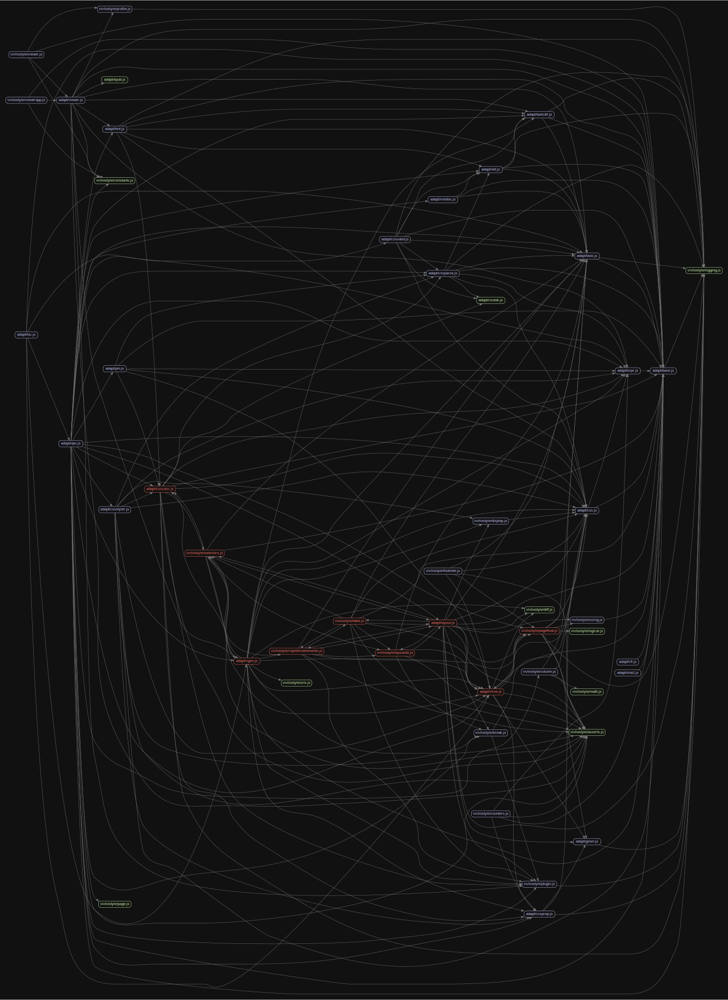

# Migration to TypeScript

Vivliostyle.js is going to change its type check system from Google Closure Compiler to TypeScript. This is the working directory for migration to TypeScript.

See also the [JS-to-TS migration](https://github.com/vivliostyle/vivliostyle.js/milestone/1) milestone.

### Code dependency graph

This is the code dependency graph generated by [Madge](https://github.com/pahen/madge).

